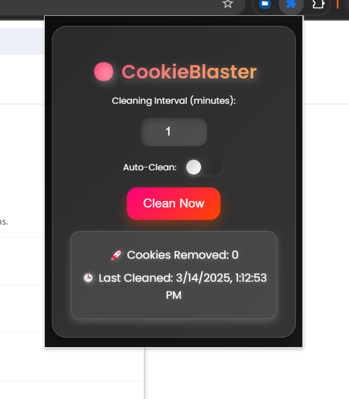

# 🚀 CookieBlaster - Advanced Auto Cookie Cleaner



**CookieBlaster** is a powerful Chrome extension that helps users automatically clean cookies at set intervals, with the option for manual cleaning as well. The extension offers a **premium, interactive UI** with **real-time stats** and an **advanced design**, providing a seamless browsing experience with better privacy.

---

## 🎯 Features
- **Auto-Clean**: Automatically removes cookies at the user-defined interval.
- **Manual Cleaning**: Clean cookies instantly with the "Clean Now" button.
- **Real-Time Stats**: Track the number of cookies removed and the last cleaned time.
- **Premium UI**: A **futuristic 3D UI** with glassmorphism, glowing effects, and interactive elements.
- **Lightweight & Efficient**: Minimal browser impact while ensuring secure and effective cookie management.

---

## 🛠️ Installation Guide
Follow these steps to install and use **CookieBlaster**:

1. **Clone the repository**:
   ```bash
   git clone https://github.com/shiboshreeroy/CookieBlaster.git
   cd CookieBlaster
   ```

2. **Load the extension in Chrome**:
   - Open **Google Chrome** and navigate to `chrome://extensions/`.
   - Enable **Developer Mode** (top right corner).
   - Click **"Load Unpacked"** and select the `CookieBlaster` folder.

3. **Done! 🎉** CookieBlaster is now installed and active on your Chrome browser.

---

## 🚀 How to Use
1. **Set Cleaning Interval**: Choose the interval (in minutes) for automatic cookie cleaning.
2. **Enable Auto-Clean**: Toggle the switch to turn auto-cleaning on or off.
3. **Clean Now**: Press the **"Clean Now"** button to instantly clear cookies.
4. **Check Stats**: View the **total cookies removed** and **last cleaned time**.

---

## 📂 File Structure

```
CookieBlaster/
│── App/
│   ├── assest/
│   │   ├── images/
│   │   │   ├── favicon.jpg
│   │   ├── style.css  # Premium 3D UI Styles
│   ├── config/
│   │   ├── popup.js   # Popup Functionality
│   │   ├── background.js # Background Auto-Cleaning
│── manifest.json  # Chrome Extension Settings
│── popup.html  # Main UI Page
│── README.md  # Documentation
```

---

## 📜 Manifest Permissions
CookieBlaster requires the following permissions:
- **`cookies`**: To manage and delete cookies across websites.
- **`storage`**: To store user settings and preferences.
- **`alarms`**: To set alarms for the auto-cleaning interval.
- **`activeTab`**: To clean cookies for the active tab, if needed.

---

## 🧑‍💻 Contribution Guidelines
We welcome contributions to improve **CookieBlaster**! Here's how you can contribute:
1. **Fork the repository** and create a new branch for your feature or fix.
2. **Write clear commit messages** explaining the changes.
3. **Submit a pull request** to the main branch.

If you encounter any issues or have feature suggestions, please open an **Issue**!

---

## 🔖 License
This project is licensed under the **MIT License**. See the **(LICENSE)**[](LICENSE)file for more details.

---

## 📌 Upcoming Features
- **Domain-Specific Cleaning**: Choose which websites should be excluded from auto-cleaning.
- **Dark/Light Mode Toggle**: Switch between light and dark themes for the UI.
- **Detailed Reports**: View daily cookie cleaning stats with charts.

---

## 📧 Contact
For support, feedback, or collaboration inquiries, please contact me at [Email](mailto:shiboshreeroy169@gmail.com).

---

## 🌟 Stars & Support
If you like CookieBlaster, please consider giving this repository a **⭐** and sharing it with others!

